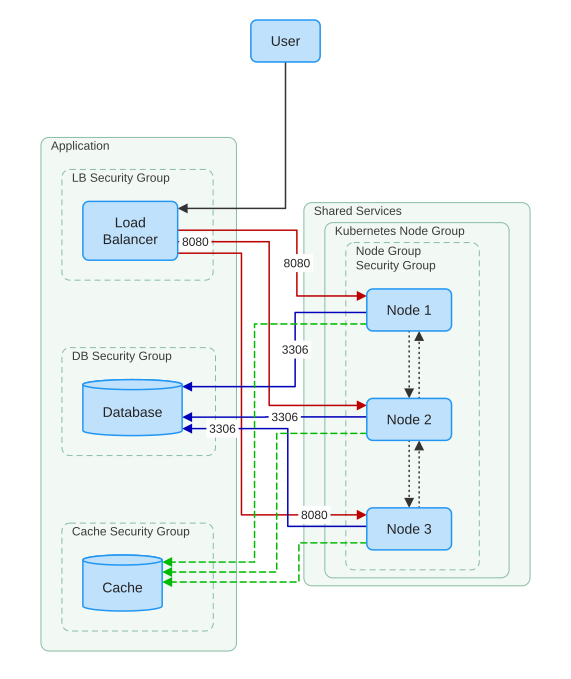
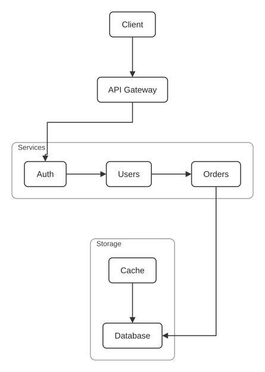

# diagrammer

A small command-line tool that reads a Mermaid-like diagram DSL and produces
SVG output. It exists to:

- produce portable SVG output that can be viewed anywhere
- give more control over group layout direction than Mermaid (which ignores a `subgraph`'s direction when edges cross group boundaries).

The written SVG is self-contained and GitHub-renderable (no scripts or external references).

## Example SVGs

 

## Usage

```
diagrammer <input.dgmr> [-o <output.svg>]
```

Input files use the `.dgmr` extension — a deliberately unique extension
(unclaimed by other formats) so editor tooling, like a vim syntax file, can
target diagrammer's grammar unambiguously. A vim syntax file matching the v0
grammar ships in [`contrib/vim`](contrib/vim).

Without `-o`, `diagrammer` parses and validates the input and prints a
one-line summary. With `-o <output.svg>`, it lays the diagram out and writes a
self-contained SVG file. Run `diagrammer --help` for details.

## Building release binaries

Docker-based cross-platform release builds live in [`build/`](build):

```bash
build/build-linux-glibc   # x86_64 glibc (shared)
build/build-linux-musl    # x86_64 musl (shared)
build/build-mac           # aarch64 macOS
```

See [`build/README.md`](build/README.md) for details.

## Input language

See [`docs/grammar.md`](docs/grammar.md) for the full grammar. Short example:

```
diagram top-down

web "Web Server" --> lb "Load Balancer"
lb --> api1
lb --> api2

api1 -- dotted --> cache
db "Postgres" : cylinder

group "Kubernetes Cluster"
    api1
    api2
end
```

See [`contrib/agent-skill/diagrammer/`](contrib/agent-skill/diagrammer) for an
agent skill to teach your coding agent how to use diagrammer.

See the [`examples/`](examples) directory for example files, including
[`examples/subdirection.dgmr`](examples/subdirection.dgmr) for a diagram
that puts two groups with *different* directions in one diagram.

Highlights:

- `diagram top-down | bottom-up | left-right | right-left`
- `group [direction] "title" ... end` — visual grouping; the optional direction lays the group out independently of the diagram's direction
- Nodes: `id` (label defaults to the id) or `id "Label"`, optional `: shape` (`box`, `cylinder`), and attributes (`color="..."`, `fill="..."`)
- Edges: `-->`, or `-- style "label" attr=... -->` for a styled/labeled edge (`solid | dotted | dashed | thick`)
- `#` line comments. Double-quoted strings with `\"` / `\\` escapes
- Implicit node declarations in edge chains are allowed; conflicting redeclarations are an error. Unknown attributes are an error
